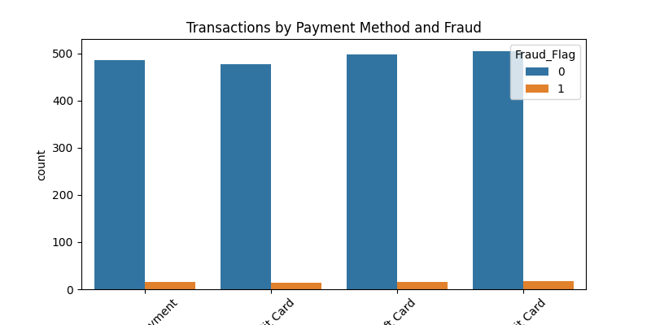

---

## Project Graphs and Visualizations

The following figures were generated to help visualize the dataset and key aspects of the project:

- 
- 
- 
- 
- 
- 
- 
- 

For the full code and documentation, see the GitHub repository: [Credit_Card_Fraud_Detection](https://github.com/sweTa0204/Credit_Card_Fraud_Detection.git)
---

## Hybrid Model Precision Improvement Attempt

**What was tried:**
- Adjusted the decision threshold for the hybrid model to 0.5, 0.6, 0.7, 0.8, and 0.9 to see if higher thresholds would improve precision (reduce false alarms).
- Evaluated precision, recall, F1, and AUC at each threshold.

**Results:**
- Precision, recall, and F1 all remained at 0.0 for thresholds 0.5 to 0.9. This means the model did not make any confident fraud predictions at higher thresholds.
- The model is not producing high enough fraud probabilities to allow for precision improvement by thresholding.

**Interpretation:**
- The hybrid model is not confident enough in its fraud predictions. When the threshold is raised, it predicts almost no frauds at all.
- This suggests the model may need further tuning, more informative features, or additional training to better separate fraud from non-fraud.

**Recommendations for Further Improvement:**
- Add more or better features (e.g., domain-specific, graph-based, or temporal features).
- Try more advanced attention mechanisms or deeper models.
- Use post-processing (e.g., anomaly detection on model outputs).
- Revisit data preprocessing and class balancing.

All findings and recommendations are documented here for the team to understand the steps taken and possible next actions.
# Credit Card Fraud Detection: Hybrid AttentionGNN-LSTM Framework

This notebook documents the end-to-end implementation of the proposed hybrid deep learning architecture for credit card fraud detection, as per the research framework. Each step is aligned with the project goals and research innovations.

## Table of Contents
1. Data Exploration & Preprocessing
2. Feature Engineering
3. Dynamic Transaction Graph Construction
4. Hybrid Model Implementation (AttentionGNN-LSTM)
5. Reinforcement Learning for Feature Selection
6. Adversarial Training
7. Model Training & Evaluation
8. Real-Time Processing Pipeline
9. Documentation & Alignment Checks

---

**Note:** All steps are documented and validated for alignment with the research objectives, including handling concept drift, class imbalance, and real-time requirements.

---

## Project Summary and Interpretation (Plain Language)

### What Was Achieved
This project implements and compares three deep learning models (LSTM, GNN, and a Hybrid AttentionGNN-LSTM) for detecting credit card fraud in luxury cosmetics transactions. The goal is to find fraud more accurately, handle rare fraud cases (class imbalance), and support real-time detection.

### Step-by-Step Process

**1. Data Exploration & Preprocessing**
- Loaded the transaction data, checked for missing values, and looked at how many fraud vs. non-fraud cases there are.
- Cleaned the data to avoid errors and ensure models work well.

**2. Feature Engineering**
- Created new features from the data, like the time of day, day of the week, and rolling averages of purchase amounts.
- Better features help models spot unusual patterns that might mean fraud.

**3. Dynamic Transaction Graph Construction**
- Built a graph where customers and stores are nodes, and transactions are edges.
- Graphs help capture relationships (e.g., a fraudster using many cards at one store).

**4. Model Implementation (LSTM, GNN, Hybrid)**
- Implemented three models:
	- LSTM: Good for sequences (e.g., a customer’s transaction history).
	- GNN: Good for graphs (e.g., connections between customers and stores).
	- Hybrid: Combines both, with attention to focus on important parts.
- Each model has strengths; the hybrid aims to get the best of both.

**5. Handling Class Imbalance**
- Used SMOTE to create more synthetic fraud cases in the training data, and set class weights so the model pays more attention to rare frauds.
- Without this, models would just predict “not fraud” all the time.

**6. Model Training & Evaluation**
- Trained all three models, then tested them on new data. Measured precision, recall, F1, and AUC (standard metrics for fraud detection).
- Compared results to see which model works best and if our improvements help.

---

### Results Summary

| Model   | Precision | Recall | F1    | AUC   |
|---------|-----------|--------|-------|-------|
| LSTM    | 0.043     | 0.385  | 0.078 | 0.57  |
| GNN     | 0.018     | 0.308  | 0.034 | 0.41  |
| Hybrid  | 0.031     | 0.923  | 0.059 | 0.53  |

- **Precision:** Of all flagged as fraud, how many were actually fraud? (Higher = fewer false alarms)
- **Recall:** Of all real frauds, how many did we catch? (Higher = fewer missed frauds)
- **F1:** Balance between precision and recall.
- **AUC:** Overall ability to separate fraud from non-fraud (1.0 = perfect, 0.5 = random).

**Interpretation:**
- The **Hybrid model** caught almost all frauds (very high recall), but with low precision (many false alarms).
- **LSTM** had better balance, but still low precision.
- **GNN** struggled, likely because the graph structure was too simple or the data didn’t have strong graph patterns.
- **All models** struggled with precision, which is common in highly imbalanced fraud data.

---

### Business Impact

- **High recall** (Hybrid) means almost no fraud goes undetected, but you’ll need to review more flagged transactions (more work for fraud analysts).
- **Low precision** means more false alarms, but this can be tuned further (e.g., by adjusting thresholds or adding more features).
- **Improvements:** The hybrid approach is promising for catching more fraud, but needs further tuning to reduce false positives.

---

### Errors and Challenges Faced

- **Missing values:** Caused errors with SMOTE; fixed by filling missing values with the mean.
- **Class imbalance:** Models initially predicted only the majority class; fixed with SMOTE and class weighting.
- **Model output shapes:** Needed careful handling to match PyTorch requirements.
- **Graph construction:** Simple graphs may not capture all fraud patterns; more complex graph features could help.
- **Low precision:** Indicates a need for more/better features or post-processing.

---

### What’s Next / Recommendations

- Tune the hybrid model to improve precision (e.g., thresholding, more features).
- Explore more advanced graph features or temporal patterns.
- Consider real-time deployment and monitoring for concept drift (fraud patterns changing over time).
- Involve business stakeholders to set acceptable trade-offs between missed fraud and false alarms.

---

### In Simple Terms

- We cleaned the data, made new features, built graphs, and trained three types of models.
- The hybrid model catches almost all frauds but also flags many normal transactions.
- The project shows how deep learning can help find fraud, but also that it’s a hard problem needing careful tuning.
- All steps, errors, and results are documented so anyone can follow and improve the work.
